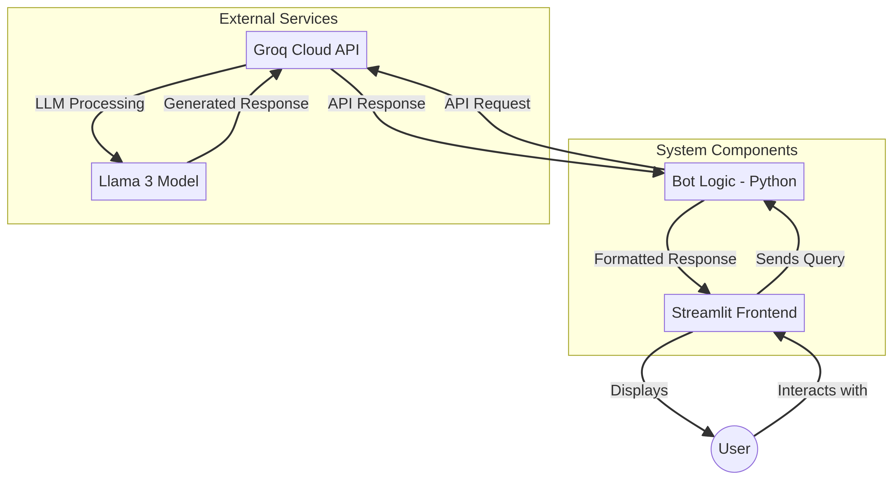
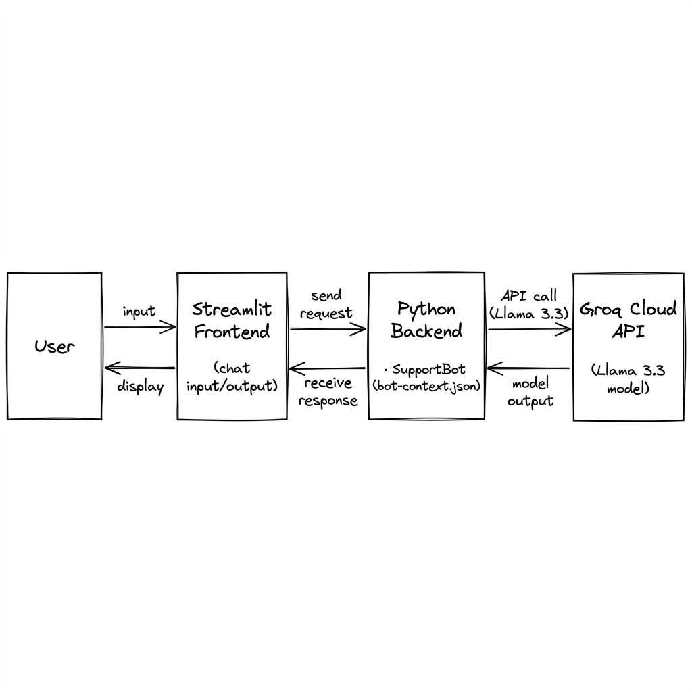
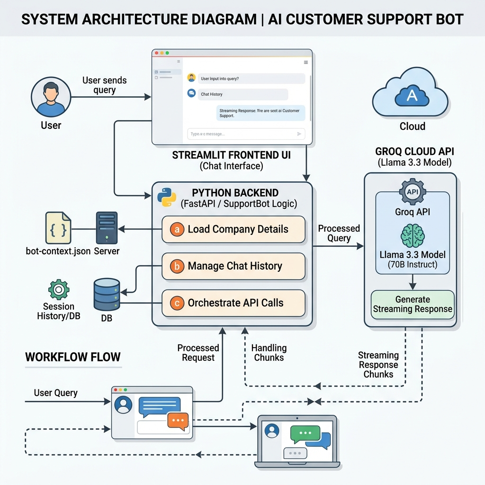

<div class="student-box">
  <h3>STUDENT DETAILS</h3>
  <table class="student-table">
    <tr>
      <td style="width: 50%;"><strong>Name:</strong> Sourabh Dinesh Yadav</td>
      <td style="width: 50%;"><strong>Cohort:</strong> MZ</td>
    </tr>
    <tr>
      <td style="width: 50%;"><strong>Roll No:</strong> 150096724013</td>
      <td style="width: 50%;"><strong>Batch:</strong> 2024-28</td>
    </tr>
  </table>
</div>

# AI Customer Support Bot - Project Documentation

## 1. Problem Statement
In today's fast-paced digital environment, businesses face the challenge of providing timely, accurate, and scalable customer support. Traditional support systems often struggle with high volumes of inquiries, leading to long wait times and decreased customer satisfaction. The objective of this project is to design and implement an AI-powered Customer Support Bot, similar to ChatGPT, that can handle user queries efficiently, provide instant responses, and improve the overall customer experience.

## 2. Proposed Solution
The proposed solution is an intelligent, context-aware chatbot customized for Visual Builders (a digital solutions and AI automation agency). The bot is built using the advanced Llama 3.3 (70B parameter) model accessed via the high-speed Groq Cloud API. This bot is designed to understand natural language queries, leverage a dynamic local business context (bot-context.json), and generate contextually relevant, polite, human-like, and accurate responses. The system features a responsive chat interface developed with Streamlit, enabling customers to interact with the bot in real-time with smooth streaming output.

## 3. System Architecture
The system architecture is designed for simplicity, speed, and scalability. It consists of three main layers: the Frontend (Streamlit), the Backend Logic (Python + Local JSON Context), and the AI Engine (Groq Cloud API + Llama 3.3).

Three representations of the system design are provided below:

### 3.1 High-Level Architecture
This diagram shows the basic message flow and component organization.


<div class="figure-caption">Figure: High-Level Architecture</div>

<div class="page-break"></div>

### 3.2 Low-Fidelity Architecture Sketch
A minimal wireframe-style representation of the components.


<div class="figure-caption">Figure: Low-Fidelity Architecture</div>

<div class="page-break"></div>

### 3.3 High-Fidelity Enterprise Architecture Diagram
A detailed, professional diagram showing the integration of the context loader, state management, and the Groq API stream.


<div class="figure-caption">Figure: High-Fidelity Architecture</div>

### Component Roles
*   **Frontend (Streamlit UI):** Provides the chat interface where customers type questions and view responses. It renders response chunks in real-time as they stream from the backend.
*   **Backend Logic (Python + JSON Context):** Acts as the orchestrator. It loads the company context from `bot-context.json`, initializes the support bot agent, manages the chat history in `st.session_state`, constructs the comprehensive system prompt, and interfaces with the Groq API.
*   **AI Engine (Groq Cloud API & Llama 3.3 Model):** Processes the prompt payloads containing the system instructions, local business context, conversation history, and the new user query to stream a natural language response.

## 4. Module Description
The project implementation is structured as follows:

*   **`python-streamlit-code/app.py` (User Interface Module):**
    *   Renders the web page and handles UI configuration (title, icon, header).
    *   Initializes the `SupportBot` instance in the Streamlit session state (`st.session_state.bot`).
    *   Maintains the list of messages (`st.session_state.messages`) to preserve conversation context.
    *   Captures user queries via `st.chat_input` and appends them to history.
    *   Triggers the response generation, using a streaming placeholder (`st.empty()`) and spinner to display the bot's response token-by-token.
*   **`python-streamlit-code/bot_logic.py` (Core Logic Module):**
    *   Defines the `SupportBot` class.
    *   Loads the company details, metrics, pricing, services, and FAQs from `bot-context.json`.
    *   Constructs a comprehensive `system_prompt` combining the agent's persona (Visual Builders support assistant), the full JSON company context, and conversational instructions (friendly demeanor, human escalation fallback to `buildersvisual@gmail.com`).
    *   Implements `stream_response` to invoke the Groq chat completions endpoint with streaming enabled (`stream=True`), yielding response chunks in real-time.
*   **`python-streamlit-code/bot-context.json` (Knowledge Base Context):**
    *   Stores the company identity (Visual Builders), contact details, key growth metrics (72h launch, 1M+ views), services (Web Dev, App Dev, AI Automation, SEO, Video Production), structured pricing tiers (Launch, Growth, Domination), and common FAQs.

## 5. Database Design
This project currently maintains state in application memory:
*   **Session-level Chat History:** Stored in `st.session_state.messages` during the active user session.
*   **Static Knowledge Base:** Maintained in `bot-context.json` and loaded at runtime.
*   *Production Path:* For persistent storage, a relational database (like PostgreSQL) or a NoSQL document store (like MongoDB) would be integrated to store user profiles, log chats for audit/safety, and cache frequent queries.

## 6. Technology Stack
*   **Programming Language:** Python 3.14+
*   **Frontend Framework:** Streamlit (v1.58.0)
*   **AI/LLM Provider:** Groq Cloud API (groq SDK v1.4.0)
*   **Language Model:** llama-3.3-70b-versatile (70B Parameter Model)
*   **Environment Configuration:** python-dotenv (v1.2.2)

## 7. Implementation Details
The interaction flow proceeds through these execution steps:
1.  **Environment Setup:** API credentials (e.g. `GROQ_API_KEY`) are loaded from `.env` via `load_dotenv()`.
2.  **Instantiation:** The `SupportBot` is created, loading company definitions and constructing the system prompt.
3.  **Chat Loop:**
    *   The user inputs a message in the text box.
    *   The frontend renders the user's message and sends the input along with the conversation history to `SupportBot.stream_response()`.
    *   `SupportBot` compiles a list of messages: `[{ "role": "system", "content": system_prompt }, ...chat_history, { "role": "user", "content": user_query }]`.
    *   An API call is sent to Groq. As tokens arrive, they are yielded back to `app.py`.
    *   `app.py` updates the UI dynamically using `st.empty()`.
    *   The full completed response is stored in `st.session_state.messages`.

## 8. Setup and Execution
To run the application locally:
1.  Navigate into the code directory:
    ```bash
    cd python-streamlit-code
    ```
2.  Install the required dependencies:
    ```bash
    pip install -r requirements.txt
    ```
3.  Configure your Groq API Key in a `.env` file:
    ```env
    GROQ_API_KEY=your_actual_groq_api_key_here
    ```
4.  Run the Streamlit server:
    ```bash
    streamlit run app.py
    ```

## 9. Future Scope
*   **Retrieval-Augmented Generation (RAG):** Connect the bot to dynamically search a vector database containing detailed project specifications, docs, or PDFs rather than passing the full context file in every prompt.
*   **Human Handoff Integration:** Create a trigger that detects when a query needs human intervention (e.g., negative sentiment or specific pricing inquiries) and alerts a support agent via Slack or email.
*   **Analytics Dashboard:** Implement a monitoring view to track chat session lengths, common questions, bot success rates, and customer feedback.
*   **Multi-Channel Deployments:** Extend the API layer to serve the chatbot on messaging apps like WhatsApp, Slack, and Discord.
